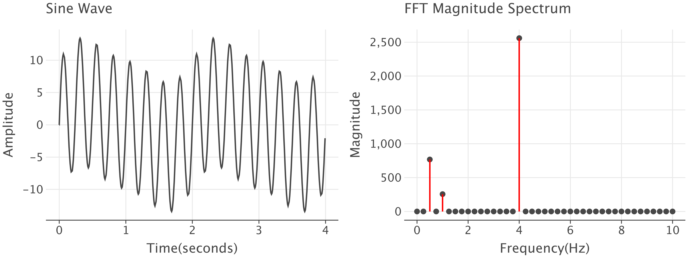
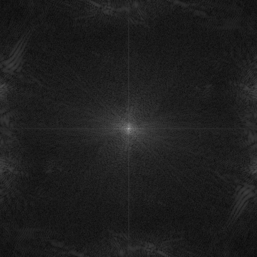
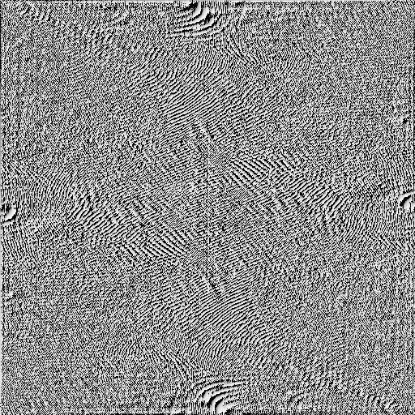

# Introduction

## Fourier Transform

Fo
urier transform is a way of expressing any function as a sum of simple sine
and cosine functions. It is a mathematical technique that transforms a function
of time or space into a function of frequency. It is used in many areas of
science and engineering, such as signal processing, image processing, and
optics.

## Discrete Fourier Transform

The Discrete Fourier Transform (DFT) is a version of the Fourier Transform that
is used for non-continuous signals, like most digital signals and images. The
DFT is defined as:

```math
X_k = \sum_{n=0}^{N-1} x_n e^{-i 2 \pi k n / N}
```

where `x_n` is the input signal (the discrete point), `X_k` is the output 
signal, and `N` is the number of points in the input signal. The DFT is a 
complex function, so it produces a complex output signal. The result of the 
DFT can be interpreted with the magnitude and phase of each frequency.

## Fast Fourier Transform

Now, the Fast Fourier Transform (FFT) is an algorithm that computes the DFT 
in a more efficient way. It reduces the amount of computation from $n^2$ to 
$n\log{n}$. 

# Implementation

I ultimately wanted to get to 2D FFT for image processing, which involved 
some sub-steps. First, I implemented 1D FFT using Cooley-Tukey algorithm in a 
recursive, divide and conquer fashion. I validated the function by testing 
it on a combination of sine functions with different frequencies and seeing 
if the magnitudes showed properly for each frequency:



After confirming that it works, I had to develop some additional functions 
to be able to convert an image into an array of discrete values to be used 
in the transformation. For a 2D case, we simply apply FFT either row-wise or 
column-wise, then apply on the resulting matrix FFT column-wise or row-wise. 
To visualize the results, the usual process is to shift the zero-frequency 
component to the center of the image, then apply logarithm to the magnitudes 
of each frequency. 

## Example of 2D FFT


|             Magnitude              |                 Phase                  |
|:----------------------------------:|:--------------------------------------:|
|  |  |

You can see how the plaid pattern gets translated into strong high frequency 
components in the magnitude image. 

# Future works

I would have liked to also implement the reverse -- i.e., an inverse FFT -- 
but due to time constraints, I am leaving this to future endeavors. It would 
also be fascinating to develop some customized filters to modify and process 
the images in some way. In conclusion, this project gave me a good 
understanding on Fourier Transformation is and what it could be used for. 